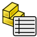

# FreeCAD_zsTools

This is a small tools workbench for [FreeCAD](https://www.freecadweb.org) which provides some useful utilities.

## Installation
Clone the repo (or download the zip) and put the folder in FreeCAD's preferences `/Mod` folder.
To find where this folder is located on your system, enter this command into FreeCAD's Python console:

    App.getUserAppDataDir()

Navigate to this folder, open the `/Mod` folder there and put the repo folder in there. Restart FreeCAD.

## Utilities
This workbench provides the following functions/utilities:

### PartInfo

Create PartInfo Attributes

This adds a new property group "PartInfo" to the selected object(s) where you can store additional part infos:

- Material
- Description

### Parts Lists

Create Parts List Spreadsheet

This adds a new Spreadsheet to the current document with a parts list of all selected objects. These spreadsheets can then be further processed, added to TechDraw drawings etc.

The spreadsheet contains the following columns:

- Pos
- Count
- Name (Label of the part)
- Material (from PartInfo above)
- Description (from PartInfo above)
- Width
- Length
- Height

### TechDraw: Export all pages to PDF

Export all TechDraw pages to PDF.

The files will be created in the current document directory.  

### TechDraw: Copy Editable Fields

Copy editable fields to subsequent pages.

The content of the editable fields are copied from the first page to subsequent pages.

(will be continued...)
